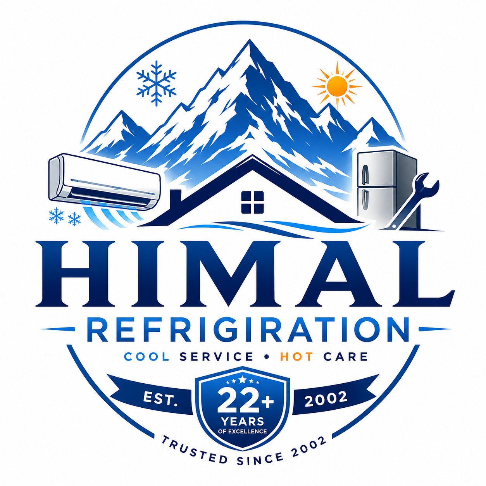

# ❄️ Himal Refrigeration - Professional Appliance Repair Service

**Your Trusted Partner for Professional Appliance Restoration in Parsa & Bara**

## 📋 Overview

Himal Refrigeration is a comprehensive **service booking management system** for appliance repair businesses. It allows customers to book repair services online (Cash on Delivery) and provides an admin dashboard to manage orders, assign technicians, track revenue, and generate reports.

### 🎯 Key Features

- ✅ **Online Service Booking** - Easy-to-use booking form with real-time price calculation
- ✅ **Cash on Delivery Only** - No online payment gateway required
- ✅ **Admin Dashboard** - Complete order management with analytics
- ✅ **Technician Assignment** - Assign technicians to pending orders
- ✅ **Revenue Tracking** - Real-time revenue analytics and reports
- ✅ **Order Management** - Update status, edit, delete orders
- ✅ **Export Reports** - CSV export and date-range reports
- ✅ **Mobile Responsive** - Works perfectly on all devices
- ✅ **WhatsApp Integration** - Direct contact via WhatsApp
- ✅ **Emergency Booking** - Priority handling for urgent requests

### 🛠️ Services Offered

| Category | Services |
|----------|----------|
| **AC Services** | Repair, Servicing, Installation, Uninstallation, Gas Filling |
| **Refrigerator** | Repair, Deep Freezer, Commercial Freezer |
| **Chiller** | Repair, Cold Room, Cold Storage |
| **Washing Machine** | Repair, Installation |
| **Water Cooler** | Repair, Dispenser Repair |
| **Geyser** | Repair, Installation |
| **Kitchen Appliances** | Microwave, Electric Oven, Induction |
| **Vehicle AC** | Repair, Gas Filling |
| **Other** | Fan, Inverter, Stabilizer, LED TV |

### 💰 Pricing (NPR)

| Service | Price (NPR) |
|---------|-------------|
| AC Repair | 2,500 |
| AC Servicing | 1,800 |
| AC Installation | 3,500 |
| Gas Filling | 4,500 |
| Refrigerator Repair | 2,800 |
| Washing Machine Repair | 2,500 |
| Chiller Repair | 6,500 |
| And 20+ more services... | |

---

## 🚀 Live Website

- **Website:** [https://himal-refrigeration.onrender.com](https://himal-refrigeration.onrender.com)
- **Booking Page:** [https://himal-refrigeration.onrender.com/booking/](https://himal-refrigeration.onrender.com/booking/)
